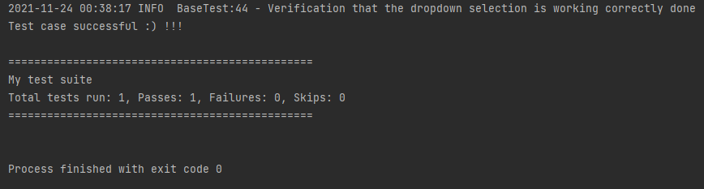
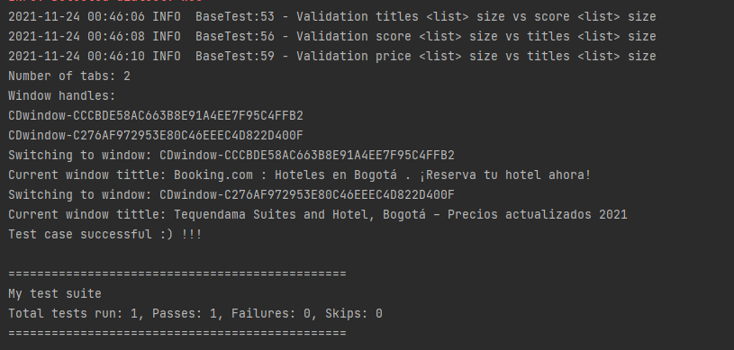
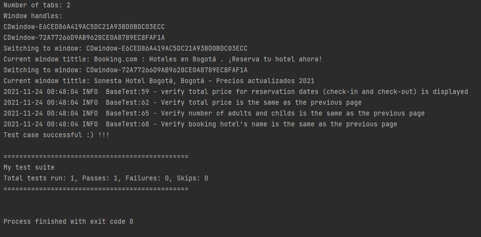
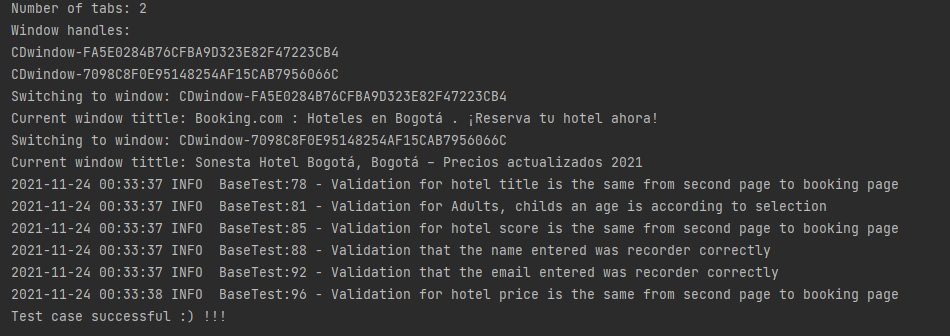

"# Booking_examen_final_AlejandroMadrid" 

Instructions to run the test

Please run the test from the suite, each class individually, the order of the runs is not important. thanks!

IDEAL RESULTS AS FOLLOWS;

@Test 1 

@Test 2

@Test 3 

@Test 4 

